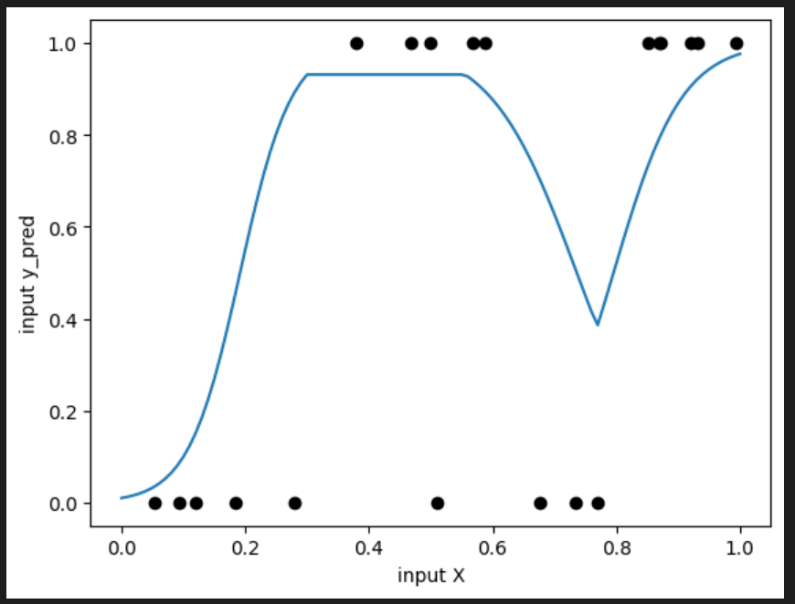
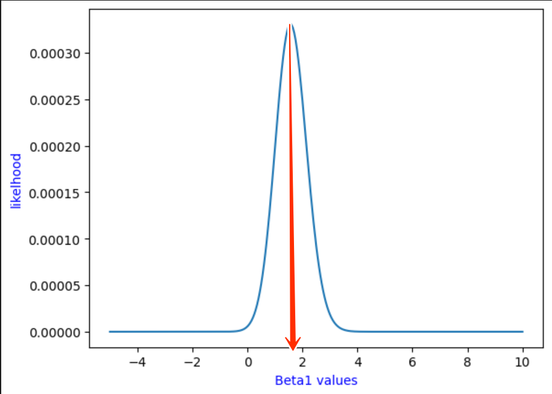
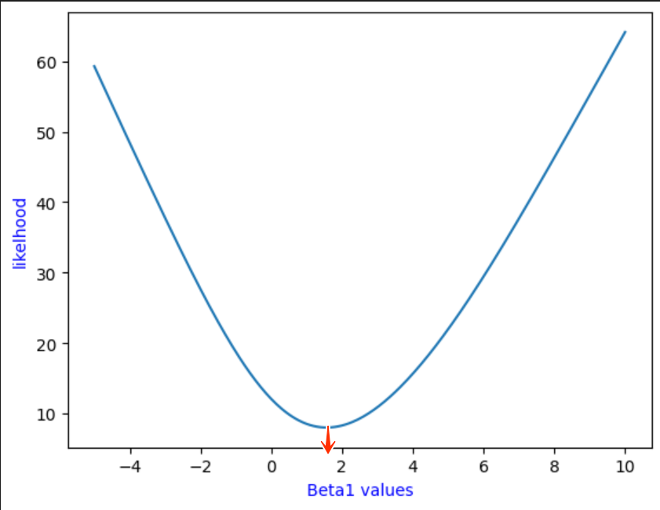
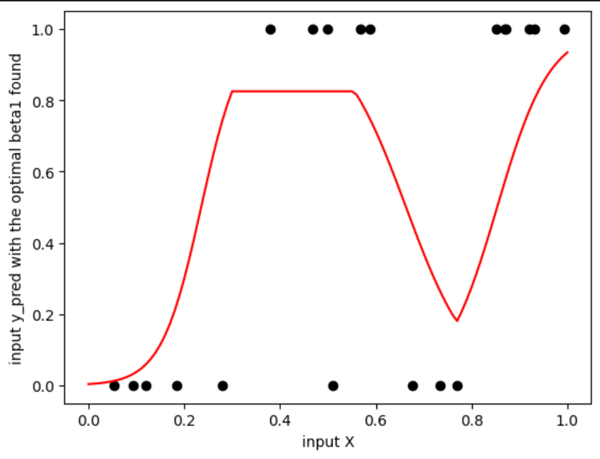

# **Binary Classification with Cross-Entropy**
This project is an introduction to Machine Learning through a simple **optimization experiment* , 
The goal is to study the impact of one parameter (bias β₁) on a model and understand if adjusting only one parameter can improve performance

## **Network Architecture**
The model consists of a simple neural network with:
- **Input Layer:** 1 input node.
- **Hidden Layer:** Multiple neurons using the ReLU activation function.
- **Output Layer:** 1 output node using the Sigmoid activation function for binary probability.

## **how it works**
**1. Data Processing :** We utilize a training set **$(x_{train}, y_{train})$**, where **$x$** represents the input and **$y$** represents the ground truth label (0 or 1).

**2. The Hidden Layer (Forward Pass) :**
   Each input is passed to the hidden layer where:
   - We compute the linear transformation: **$z = (x \cdot \omega_0) + \text{bias}_0$**.
   - We apply the ReLU (Rectified Linear Unit) activation function: **$f(z) = \max(0, z)$**
   - Purpose: ReLU introduces non-linearity allowing the network to decide whether a neuron should be (activate) or remain inactive.
     
**3. Output Generation :** The outputs from the hidden layer are multiplied by weight **$\omega_1$** and added to **$\beta_1$** (the bias) The final result **$f(x)$** is passed through the Sigmoid Function:
 **$$\sigma(f(x)) = \frac{1}{1 + e^{-f(x)}}$$** , This maps any real-valued number into a probability between 0 and 1
 
 

## **Optimization & Likelihood**
The core of this project is finding the optimal $\beta_1$. We use the following statistical approach:

**- Bernoulli Distribution:** Since the output is binary, we model the probability using $P(y|\hat{y}) = \hat{y}^y \cdot (1-\hat{y})^{(1-y)}$. 

**-Finding the Optimal Bias:** To find the best value, we take a range of $\beta_1$ values and repeat the perceptron process. For each value in the range, a model is created and evaluated against the entire training dataset. We then calculate the **Likelihood and NLL** for each model and plot them against the range of $\beta_1$ values.

**- Likelihood Function:** We calculate the product of these probabilities for all data points. The highest point on this graph represents our optimal $\beta_1$.

**- Log-Likelihood:** Because multiplying many probabilities results in numbers too small for computers to handle (underflow) we apply a Logarithm to turn products into sums.

**- Negative Log-Likelihood (NLL):** We multiply by $-1$ because most optimization algorithms are designed to minimize error rather than maximize success , The minimum of the NLL curve corresponds exactly to the maximum of the Likelihood curve 

## **Conclusion & Limitations**
In this experiment, we found an "optimal" **$\beta_1 \approx 1.5$** by fixing other parameters and searching for the best bias. However, visualizing the results showed a suboptimal global fit

**Key Takeaway:** The found $\beta_1$ represents a **local optimum** Because we only tuned one parameter while keeping weights fixed the model lacks the flexibility to fit all data points perfectly.
**Next Steps:** To reach the Global Minimum of the cost function a more robust approach is required: training all weights and biases simultaneously using the **Gradient Descent** algorithm.

   
   
